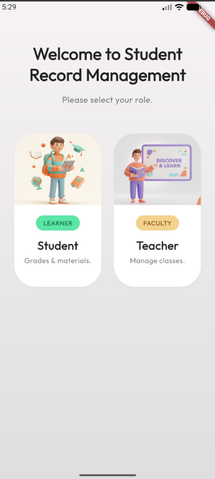
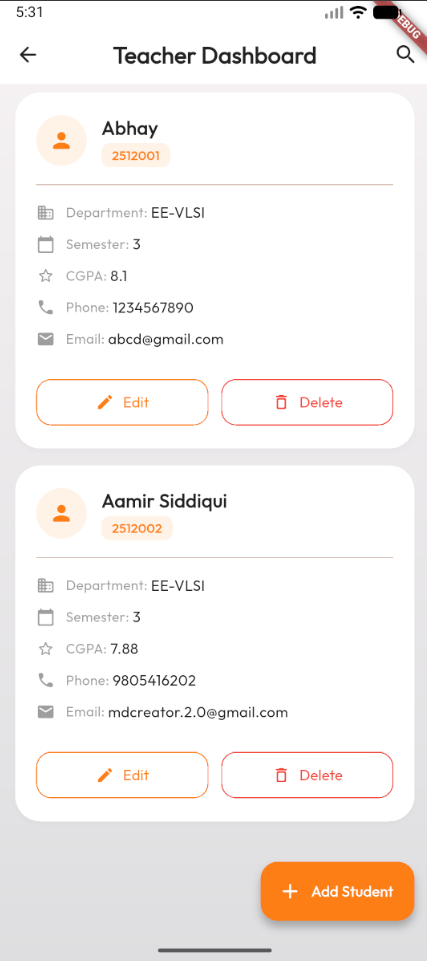
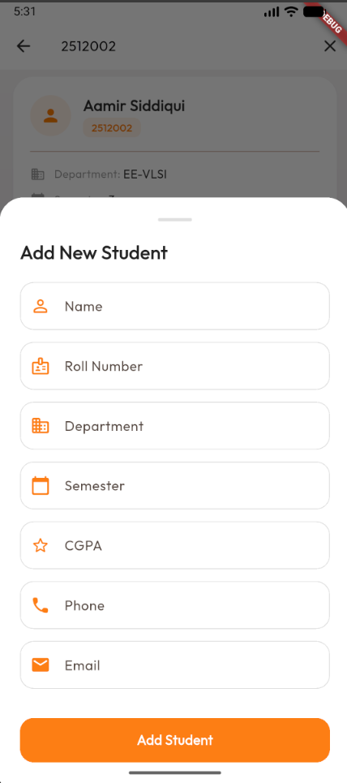
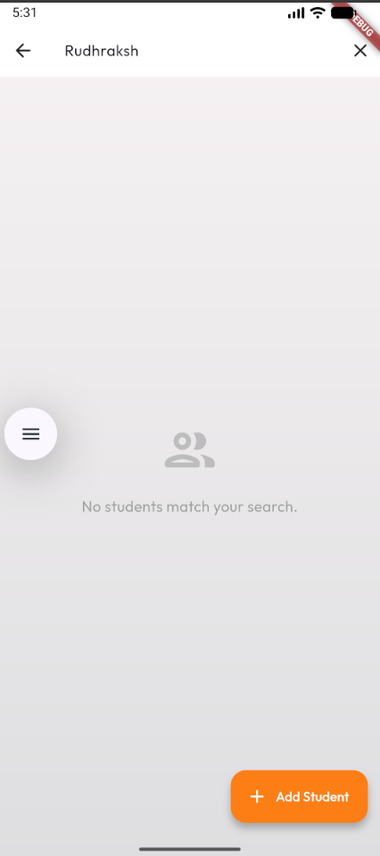
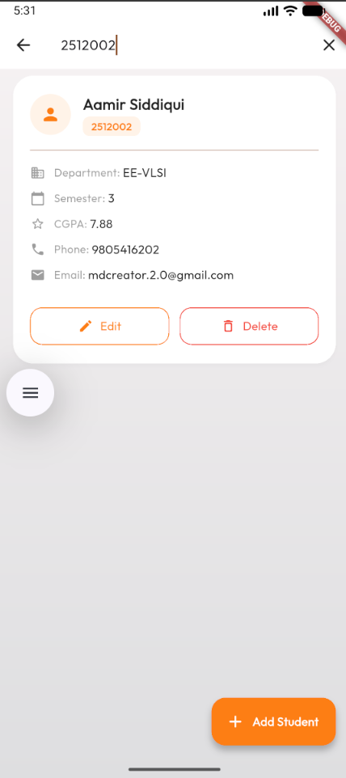
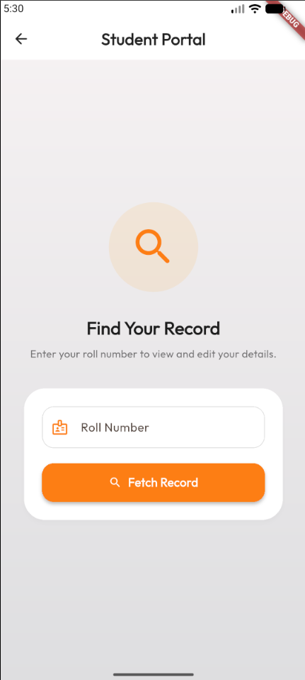
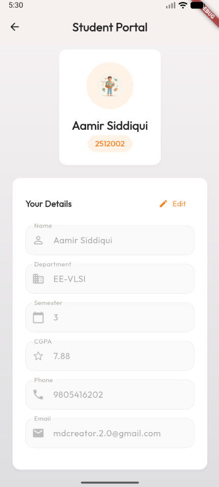
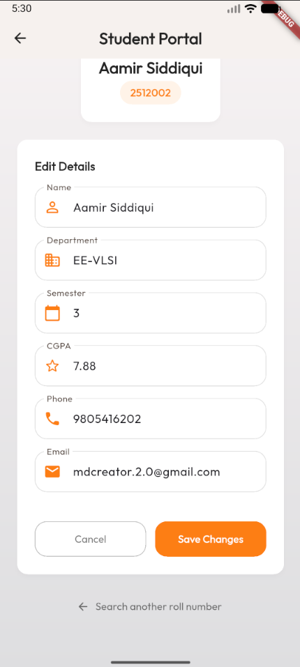

# 🎓 Student Record Management App - Mohmmad Ameer Siddqui

A role-based(Simulated) Flutter CRUD application built to manage student records using Firebase Firestore. 

## ✨ Features
- **Role-Based Access**: Choose between Student (Learner) and Teacher (Faculty) portals.
- **Student Portal**: Students can search for their record by Roll Number to view and update their personal details.
- **Teacher Dashboard**: Teachers have a real-time view of all students, with inline editing capabilities, safe deletion dialogues, and the ability to add new records.
- **Real-Time Database**: Powered by Firebase Firestore for live sync.
- **No External State Management**: Entirely built using standard Flutter `setState()` for optimal simplicity.
- **Vibrant UI**: Custom colorful theme with modern, rounded design elements.

---

## 🚀 Getting Started

Follow these instructions to set up the project locally on your machine.

### 1. Prerequisites (Flutter CLI Installation)
If you haven't installed Flutter yet, you'll need the Flutter SDK and CLI.

### 2. Project Initialization
1. Clone the repository:
   ```bash
   git clone https://github.com/Rudraksha-git/TeamNougat-student-record-management.git
   ```
2. Navigate to the project directory:
   ```bash
   cd TeamNougat-student-record-management/lib/tasks/mohmmad_ameer
   ```
3. Install Flutter packages:
   ```bash
   flutter pub get
   ```

### 3. Firebase Setup
This app relies on Firebase Firestore. You need to connect it to your own Firebase project.

1. **Install Firebase CLI:**
   ```bash
   npm install -g firebase-tools
   ```
2. **Login to Firebase:**
   ```bash
   firebase login
   ```
3. **Install FlutterFire CLI:**
    run this in your flutter project directory(lib/task/mohmmad_ameer)
   ```bash
   dart pub global activate flutterfire_cli
   ```
4. **Create a Firebase Project:**
   Go to the [Firebase Console](https://console.firebase.google.com/) and create a new project. Enable **Firestore Database** in test mode.
5. **Configure FlutterFire:**
   Run the following command inside the flutter project directory(lib/task/mohmmad_ameer) and select your newly created Firebase project:
   ```bash
   flutterfire configure
   ```
   *(This will automatically generate the `lib/firebase_options.dart` file required to connect the app).*

   **NOTE: Make sure you add `lib/firebase_options.dart` in your gitignore if not there yet** 

### 4. Running the App
Once everything is configured, run the app on your connected emulator or physical device:
```bash
flutter run
```

---

## 📸 UI Showcase

| Role Selection / Landing Page | Teacher Dashboard |
| :---: | :---: |
|  |  |

| Add Student Bottom Sheet | Dashboard Search by Name |
| :---: | :---: |
|  |  |

| Dashboard Search by Roll No. | Student Portal (Fetch Record) |
| :---: | :---: |
|  |  |

| Student Details View | Student Details Inline Edit |
| :---: | :---: |
|  |  |

---

## 🛠️ Tech Stack
- **Framework:** Flutter / Dart
- **Backend/Database:** Firebase Firestore
- **Fonts:** Google Fonts (Outfit)
- **State Management:** Native `setState()`

---

**Author:** Mohammad Ameer  
**Repository:** [TeamNougat-student-record-management](https://github.com/Rudraksha-git/TeamNougat-student-record-management)

---

## 🤖 AI Contribution
This project was developed with the pair-programming assistance of Antigravity AI Assistant. 

### How AI helped:
- **UI/UX Implementation:** Accelerated the development of the "Vibrant Colorful" theme by scaffolding the UI components from Stitch design references.
- **State Management:** Assisted in architecting a clean, native `setState()` based data flow without relying on heavy third-party state packages.
- **Debugging & Best Practices:** Quickly diagnosed and resolved layout issues, deprecated widget warnings, and ensured adherence to Flutter best practices.
