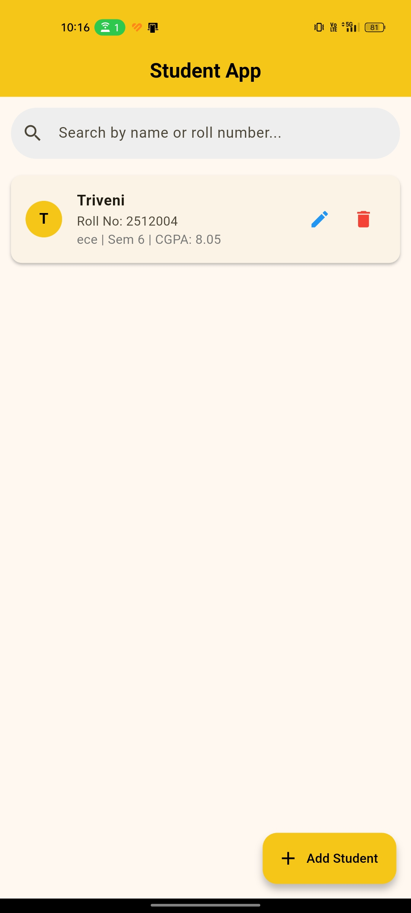
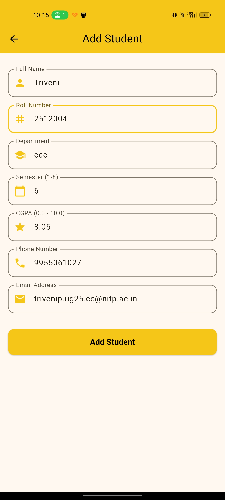
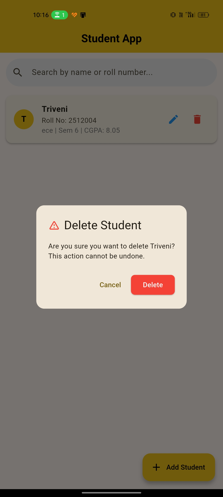
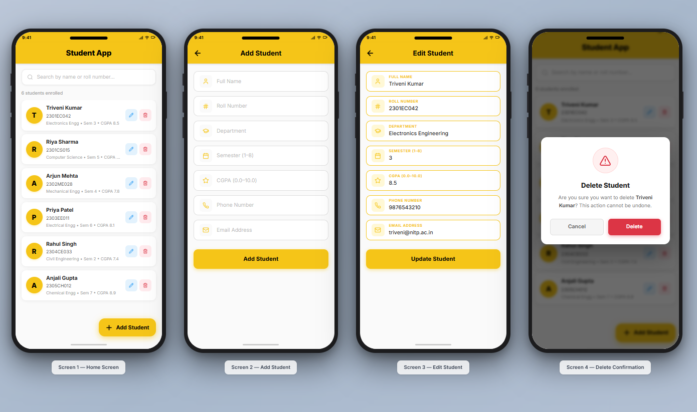

<div align="center">


<br /><br />

# 🎓 Student Record Management App

### A Flutter CRUD Application — NIT Patna Flutter Development Club Task

**Built by [Triveni Narayan Priy](https://github.com/triveninarayanpriy)**
`lib/tasks/triveni/`

<br />

</div>

---

## 📖 Overview

A fully functional **Student Record Management System** built in Flutter with **Firebase Firestore** as the real-time cloud backend. The app delivers a smooth, golden-yellow themed UI and supports complete **CRUD operations** across all 7 student data fields — with real-time list updates via `StreamBuilder`, live search filtering, and robust form validation — all powered exclusively by Flutter's native `setState()`, with no external state management libraries.

This project was submitted as part of the **TeamNougat Flutter Club Task** at **NIT Patna**, covering Flutter UI development, Firebase Firestore integration, Git/GitHub collaboration workflow, and core CRUD fundamentals.

---

## ✨ Features

### 🏠 Home Screen
- **Real-time student list** — powered by Firestore `snapshots()` stream; the UI rebuilds automatically on every database change without a manual refresh
- **Search bar** — filters the list by Name or Roll Number in real-time using `setState()`; includes an inline clear (×) button to reset instantly
- **Student cards** — each card shows a golden avatar with the student's initial, full name, roll number, department, semester, and CGPA
- **Edit** (blue icon) and **Delete** (red icon) action buttons on every card
- **Extended FAB** — yellow floating action button labelled "Add Student" routes to the add form

### ➕ Add Student Screen
- **7-field validated form** — Name, Roll Number, Department, Semester, CGPA, Phone, Email
- Each field has a themed yellow prefix icon and a focused yellow border
- **Validation rules:** no empty field allowed; Semester must be 1–8; CGPA must be 0.0–10.0; Phone must be exactly 10 digits; Email must contain `@` and `.`
- Full-width yellow submit button shows a `CircularProgressIndicator` while saving
- On success: green snackbar confirmation + automatic navigation back to Home

### ✏️ Edit Student Screen
- **Identical layout** to the Add screen — reuses a single `AddEditStudentScreen` widget
- Form fields are **pre-filled** with the existing student's data via `TextEditingController` initialisation in `initState()`
- Submit button reads "Update Student"; calls Firestore `update()` on the existing document ID
- On success: green snackbar confirmation + navigation back to Home

### 🗑️ Delete Confirmation Dialog
- `AlertDialog` with a red warning icon, the student's name in the message body, and two action buttons
- **Cancel** — safely dismisses the dialog with no data change
- **Delete** — closes the dialog first, then calls Firestore `delete()`, and shows a red snackbar to confirm removal

### 🗄️ Firebase Firestore
- All student records are persisted in the cloud and synced in real-time across sessions
- `StreamBuilder<List<Student>>` drives the home list — emits a fresh snapshot on every Firestore write
- `async / await` with `try / catch` on every database call for graceful error handling
- Records are ordered alphabetically by name via `orderBy('name')`

---

## 📸 UI Showcase

| Home Screen | Add Student |
|:---:|:---:|
|  |  |

| Edit Student | Delete / Confirmation |
|:---:|:---:|
|  |  |

| Search Student | Figma Design Reference |
|:---:|:---:|
|  |  |

> 📁 Screenshots are located in `lib/tasks/triveni/screenshots/`

---

## 🛠️ Tech Stack

| Layer | Technology |
|---|---|
| Framework | Flutter 3.x / Dart 3.x |
| Database | Firebase Firestore (Cloud NoSQL) |
| Firebase Init | Firebase Core |
| State Management | Native `setState()` — no Provider, Bloc, or Riverpod |
| Architecture | Service-layer pattern — all Firestore logic isolated from UI |
| IDE | VS Code + Flutter & Dart extensions |
| Version Control | Git + GitHub |

---

## 📁 Folder Structure

```
lib/tasks/triveni/
├── models/
│   └── student.dart                   # Student data class — toMap() and fromMap()
├── services/
│   └── firestore_service.dart         # Firestore CRUD — addStudent, getStudents stream,
│                                      # updateStudent, deleteStudent
└── screens/
    ├── home_screen.dart               # Home — StreamBuilder list, search bar, FAB
    └── add_edit_student_screen.dart   # Dual-mode form — Add & Edit in one widget
```

---

## 🚀 Getting Started

### Prerequisites

Ensure the following are installed before proceeding:

- [Flutter SDK 3.16+](https://docs.flutter.dev/get-started/install/windows)
- [Git](https://git-scm.com/download/win)
- [VS Code](https://code.visualstudio.com/) with the Flutter and Dart extensions
- Android Studio (for Android SDK + emulator only — coding is done in VS Code)
- A Google account for [Firebase Console](https://console.firebase.google.com)

Verify your environment:
```bash
flutter doctor
```

---

### 1. Fork & Clone

```bash
# Clone your fork (replace YOUR-USERNAME)
git clone https://github.com/YOUR-USERNAME/TeamNougat-student-record-management.git
cd TeamNougat-student-record-management
```

### 2. Install Flutter Packages

```bash
flutter pub get
```

### 3. Firebase Project Setup

#### 3a — Create a Firebase Project
1. Go to the [Firebase Console](https://console.firebase.google.com) → **Add project**
2. Name it (e.g. `StudentRecordApp`) → disable Google Analytics → **Create project**
3. Navigate to **Build → Firestore Database → Create Database**
4. Select **Start in test mode** → choose region `asia-south1` → **Done**

#### 3b — Register the Android App
1. In Firebase Console → click the **Android icon**
2. Package name: `com.example.student_record_app`
3. Click **Register app** → **Download `google-services.json`**
4. Place the file at: `android/app/google-services.json`

#### 3c — Configure Gradle

**`android/build.gradle`** — add inside `buildscript → dependencies`:
```groovy
classpath 'com.google.gms:google-services:4.4.2'
```

**`android/app/build.gradle`** — set `minSdkVersion` to `23` and add as the **last line**:
```groovy
apply plugin: 'com.google.gms.google-services'
```

#### 3d — Internet Permission

In `android/app/src/main/AndroidManifest.xml`, add before `<application>`:
```xml
<uses-permission android:name="android.permission.INTERNET"/>
```

### 4. Run the App

```bash
flutter run
```

> ⏱ First build takes 3–5 minutes. Press **R** for Hot Reload · **r** for Hot Restart · **q** to quit.

---

## ⚙️ pubspec.yaml

```yaml
dependencies:
  flutter:
    sdk: flutter
  firebase_core: ^3.6.0
  cloud_firestore: ^5.4.4
  cupertino_icons: ^1.0.8
```

---

## 🗂️ Firestore Data Structure

```
Firestore Database
└── students  (Collection)
    └── {auto-generated-id}  (Document — one per student)
        ├── name:         "Triveni Narayan Priy"
        ├── rollNumber:   "2301EC042"
        ├── department:   "Electronics Engineering"
        ├── semester:     "3"
        ├── cgpa:         "8.5"
        ├── phone:        "9876543210"
        └── email:        "triveni@nitp.ac.in"
```

---

## ✅ CRUD Operation Reference

| Operation | Screen | Firestore Call |
|---|---|---|
| **Create** | Add Student → Submit | `collection.add(student.toMap())` |
| **Read** | Home Screen list | `collection.orderBy('name').snapshots()` via `StreamBuilder` |
| **Update** | Edit Student → Update | `collection.doc(id).update(student.toMap())` |
| **Delete** | Delete Dialog → Confirm | `collection.doc(id).delete()` |
| **Search** | Home Screen search bar | Client-side `.where()` filter on stream data with `setState()` |

---

## ⚠️ Common Errors & Fixes

```
ERROR: PlatformException — firebase_core/no-app
FIX:   In main(), add before runApp():
         WidgetsFlutterBinding.ensureInitialized();
         await Firebase.initializeApp();

ERROR: Gradle build failed — google-services plugin not found
FIX:   Confirm google-services.json is inside android/app/ (not android/)
       AND the classpath line is in android/build.gradle
       AND 'apply plugin' is the very last line of android/app/build.gradle

ERROR: PERMISSION_DENIED (Firestore)
FIX:   Firebase Console → Firestore → Rules:
         allow read, write: if true;
       Click Publish and wait 60 seconds for propagation.

ERROR: No connected devices
FIX:   Start your Android emulator first, then run flutter run.
       Or connect a physical device with USB Debugging enabled.

ERROR: Compilation errors after pub get
FIX:   Run flutter clean → flutter pub get → flutter run
```

---

## 🤖 AI Assistance

This project was developed with learning guidance from **Claude (Anthropic AI)** as a pair-programming and study tool.

| Area | AI Contribution |
|---|---|
| Architecture | Explained Flutter app structure, data flow, and service-layer pattern |
| Code Guidance | Walked through writing all 5 project files with inline explanatory comments |
| Firebase Setup | Guided Gradle configuration, `google-services.json` placement, and Firestore rules |
| Debugging | Explained common Flutter/Firebase errors and provided exact resolution steps |
| Git Workflow | Guided fork → clone → commit → PR process for team collaboration |

> All code was written, reviewed, understood, and tested by the author. AI was used purely as a learning accelerator.

---

## 📋 Submission Checklist

- [x] Full CRUD operations integrated with Firebase Firestore
- [x] Real-time list updates via `StreamBuilder`
- [x] Search by Name and Roll Number with `setState()`
- [x] Add Student — 7-field form with complete input validation
- [x] Edit Student — pre-filled dual-mode form (same widget as Add)
- [x] Delete — confirmation dialog before permanent removal
- [x] Semester range (1–8), CGPA range (0.0–10.0), phone (10 digits), email format validated
- [x] `setState()` only — zero external state management packages
- [x] Golden yellow Material Design 3 themed UI
- [x] Figma wireframe designed prior to coding
- [x] Screenshots included in `screenshots/` folder
- [x] Clean Git commits with descriptive messages
- [x] Pull Request raised before Saturday 27th June — EOD

---

## 📄 License

Created as a learning task for the **Flutter Development Club, NIT Patna**.
Free to reference for educational purposes.

---

<div align="center">

**Made with ❤️ by Triveni Narayan Priy**

B.Tech ECE (VLSI Design & Technology) · 3rd Semester · NIT Patna
Manager — Innovation Hub &nbsp;|&nbsp; Co-Founder — Samvad Debate Club &nbsp;|&nbsp; NSS Member

*NIT Patna — Flutter Development Club · June 2025*

</div>