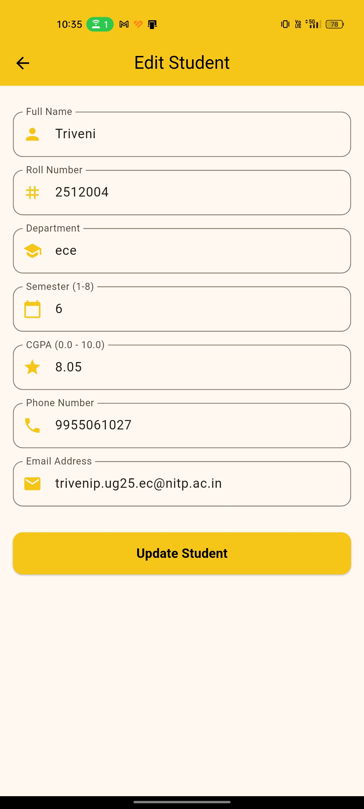
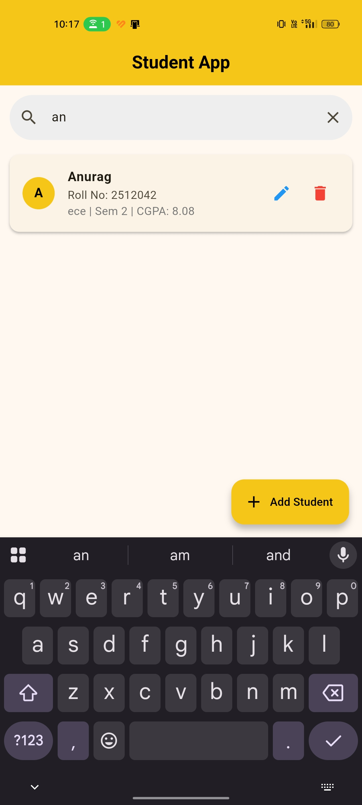
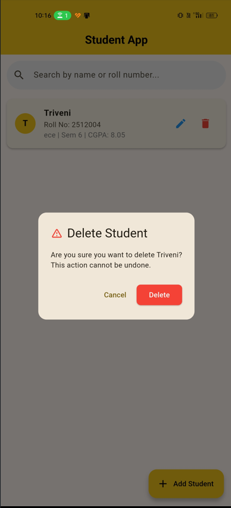

<div align="center">


<br /><br />

# 🎓 Student Record Management App

### A Flutter CRUD Application — NIT Patna Flutter Development Club Task

**Built by [Triveni Narayan Priy](https://github.com/triveninarayanpriy)** | `lib/tasks/triveni/`

<br />

</div>

---

## 📖 Overview

A functional **Student Record Management System** built with Flutter and **Firebase Firestore**. This project was developed for the **TeamNougat Flutter Club Task** at **NIT Patna** to demonstrate proficiency in native UI development, real-time database integration, and standard version control workflows. 

The application supports complete **CRUD operations** across 7 distinct data fields, utilizing real-time stream subscriptions and native state management (`setState()`) without relying on external state management libraries.

---

## ✨ Core Features

* **Real-Time Data Sync:** Firestore `snapshots()` stream automatically rebuilds the UI on database changes without manual refreshing.
* **Dynamic Search:** Client-side filtering allows users to instantly search the database by Name or Roll Number.
* **Dual-Mode Form:** A single, reusable `AddEditStudentScreen` handles both document creation and pre-filled updates via `TextEditingController` initialization.
* **Robust Validation:** Strict input rules enforced for Semester (1–8), CGPA (0.0–10.0), Phone (exact 10 digits), and Email structure.
* **Figma-First Design:** The application UI was wireframed and prototyped in **Figma** prior to coding to ensure consistent layout, color hierarchy, and structural clarity.

---

## 📸 UI & Design Showcase

<table align="center">
  <tr>
    <td align="center"><b>Home Screen</b><br><br></td>
    <td align="center"><b>Add Student</b><br><br></td>
    <td align="center"><b>Edit Student</b><br><br></td>
  </tr>
  <tr>
    <td align="center"><b>Search Functionality</b><br><br></td>
    <td align="center"><b>Delete Confirmation</b><br><br></td>
    <td align="center"><b>Figma Wireframe</b><br><br></td>
  </tr>
</table>

> *Note: Original screenshots are located in the `lib/tasks/triveni/screenshots/` directory.*

---

## 🛠️ Technical Architecture

| Component | Technology Used |
|---|---|
| **Framework** | Flutter 3.x / Dart 3.x |
| **Backend** | Firebase Firestore (Cloud NoSQL) |
| **State Management** | Native `setState()` |
| **Pattern** | Service-layer architecture (Firestore logic isolated from UI) |

### 📁 Directory Structure
```text
lib/tasks/triveni/
├── models/
│   └── student.dart                 # Data model (toMap / fromMap)
├── services/
│   └── firestore_service.dart       # Isolated Firebase CRUD logic
└── screens/
    ├── home_screen.dart             # StreamBuilder, Search, FAB
    └── add_edit_student_screen.dart # Form validation and dynamic state
    🤖 Development Workflow & Tooling
To optimize the development cycle and maintain high code quality, external tools were utilized strategically:

Figma: Used for initial UI wireframing and component planning before writing widget trees.

AI Assistants: Leveraged specifically for faster debugging and testing. This included rapidly isolating Gradle build conflicts, optimizing Firestore security rules, and generating edge-case mock data to test form validation boundaries. All core logic and architecture were manually implemented and reviewed.

📋 Task Requirements Checklist
[x] Full CRUD operations integrated with Firebase Firestore

[x] Real-time list updates via StreamBuilder

[x] Search filtering by Name and Roll Number

[x] 7-field form with strict input validation

[x] Pre-filled update forms & Delete confirmation dialogs

[x] Exclusively native setState() usage (No Provider/Bloc)

[x] UI designed in Figma prior to implementation

[x] Clean Git commits and PR raised before the deadline

Triveni Narayan Priy
B.Tech ECE (VLSI Design & Technology) · NIT Patna
Flutter Development Club · June 2026
